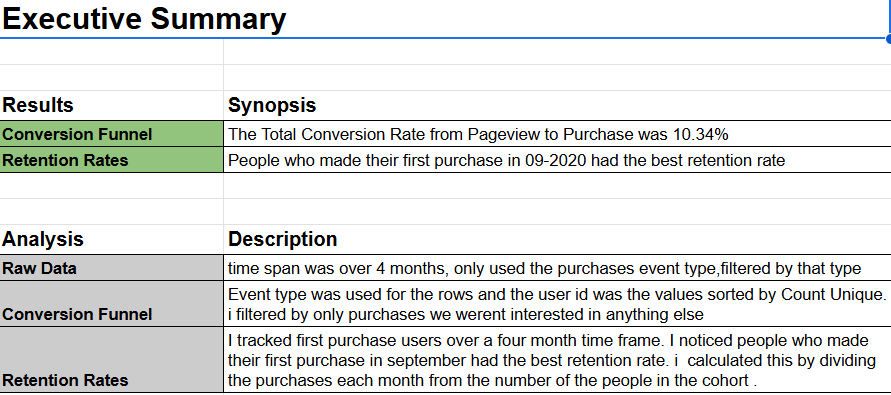

# Conversion Funnel and Cohort Analyst Project 2

[Click here to see Google Sheets Project --> ](https://docs.google.com/spreadsheets/d/13sr1Y74RvONUH_Iw43jgVmJMnsJZ7LrZqNQQC64F-BA/edit?usp=sharing)

## Overview
* A E-Commerce Company gave me a task to analyze their raw transaction logs. Each row of data represents an activity, or event, by a user on the company’s website. Each time a user views a product page, opens their shopping cart, or completes a purchase, the event is captured in the activity logs.

## Steps Taken
* Built a conversion funnel in a pivot table counting the unique users for each stage and added two new columns to the pivot table for total conversion rate and conversion rates
* Created a acquisition Cohort based on the month of a users first purchase and tracked month to month , Filtered by purchases to eliminate event types that didnt end in purchases 
* With the new purchase activitity being isolated in its own table i calculated the first purchase date for each user to create cohorts by using the minimum event_date for each user
* Grouped the users and transactions by month by creating three new columns in the "Purchase activity" sheet to help build the cohorts: event_month, first_purchase_month, and cohort_age
Lastly aggregated the purchase data into cohorts and then calculated retention rates for each cohort month by month by creating a pivot table representing each cohort that is based on the month customers made their first purchase 

## Images

