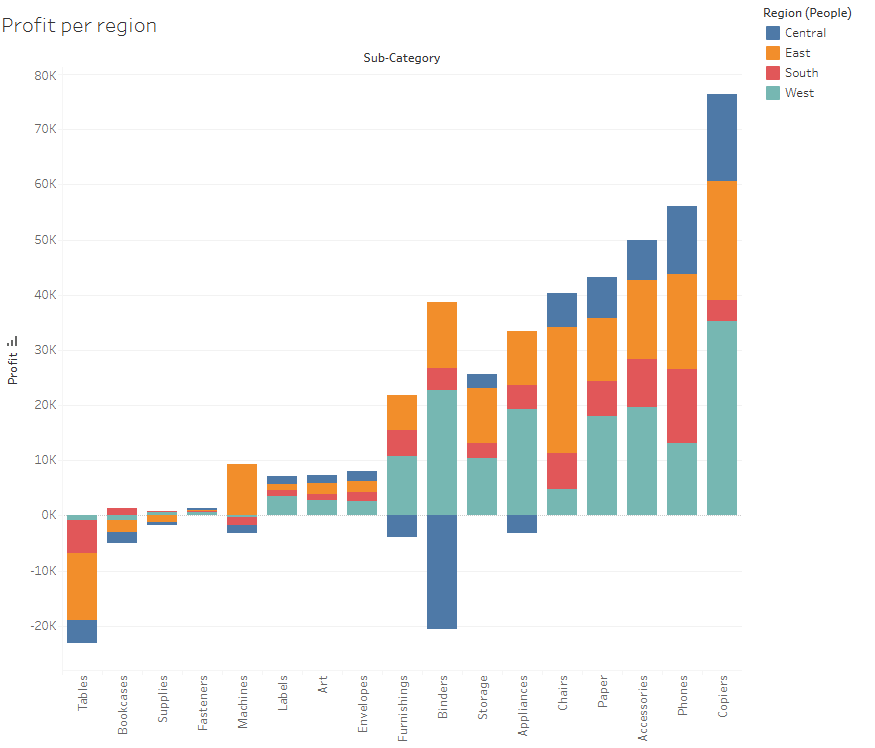
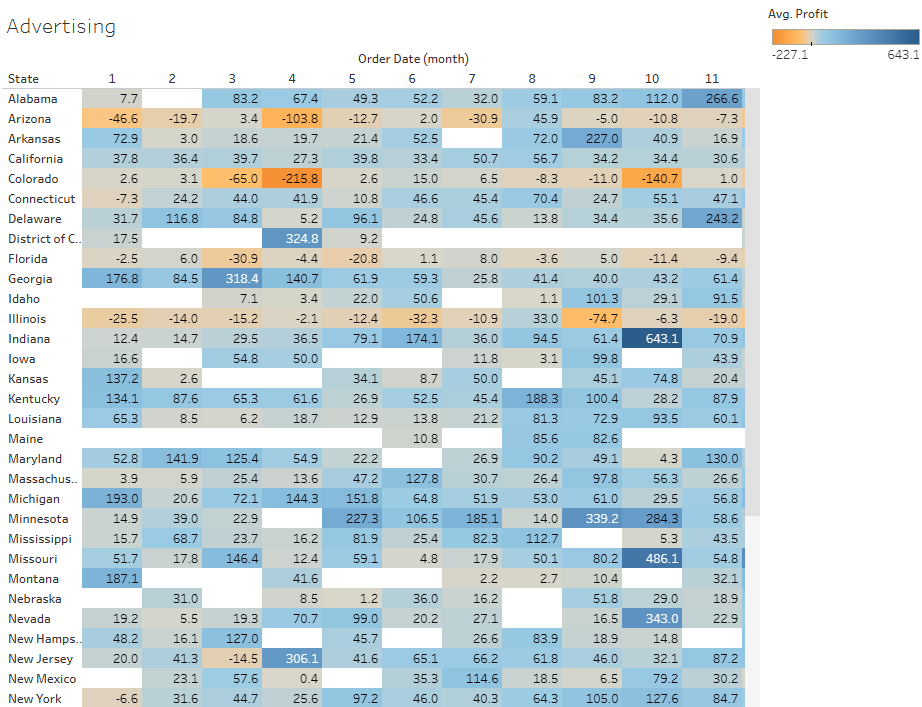
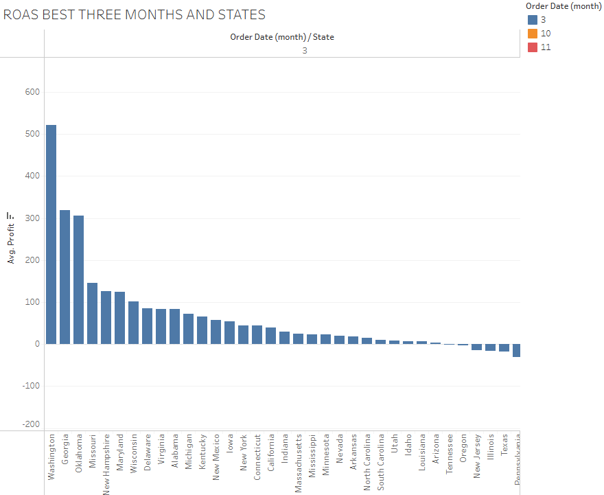
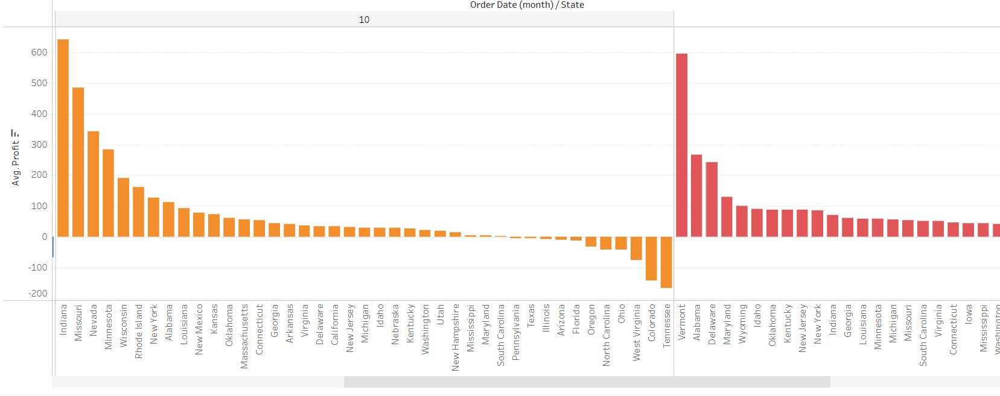
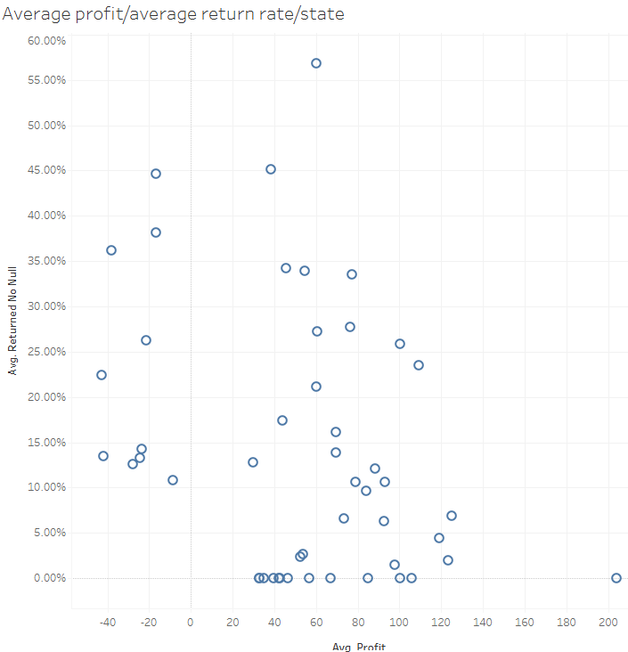

# Superstore Project 3 

[Click here to see Tableau Project --> ](
https://public.tableau.com/views/project4_17132923486990/Averageprofitaveragereturnratestate?:language=en-US&publish=yes&:sid=&:display_count=n&:origin=viz_share_link)

## Overview
* A Superstore gave me a task as a consultant to review the operations and increase its profitability to avoid bankruptcy.

## Steps Taken
* Created a bar graph to visualize the profit and losses by region for the sub categories 
* Needed to see if advertising was worth it by checking the average profit per unit sold so i found the best three states and months of the year by using Return On Ad Spending 
* Created a Visual for returned items by using the average profit against the average return rate 

## Images

Above is a Bar Graph of Profit per region 

Above is a visual of Average Profit per state and the order month using that information i focused on March (3) , October(10) and Novemeber (11)

 

Above is the Return of Ad spending for every state for those three months

Above is the Average profit to Average Return Rate for each State 

